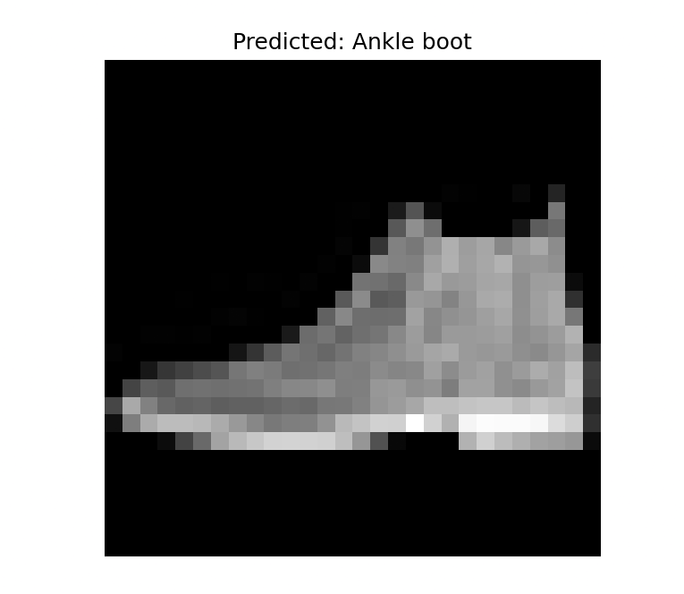
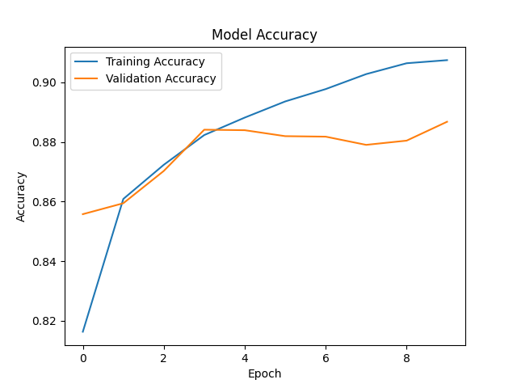

# TensorFlow Fashion Classifier

A beginner-friendly machine learning project built using TensorFlow and Keras to classify clothing images from the Fashion MNIST dataset.

## Project Overview

This project trains a neural network to recognize different categories of clothing such as:
- T-shirts
- Dresses
- Sneakers
- Bags
- Ankle boots

The model is trained using the Fashion MNIST dataset included with TensorFlow.

## Features

- Loads and preprocesses image datasets
- Builds a neural network using TensorFlow/Keras
- Trains and evaluates the model
- Saves the trained model
- Loads the saved model for predictions
- Displays prediction results visually using Matplotlib

## Technologies Used

- Python
- TensorFlow
- Keras
- NumPy
- Matplotlib

## Project Structure

```text
tensorflow-fashion-classifier/
├── train.py
├── predict.py
├── requirements.txt
├── models/
├── screenshots/
└── README.md
```

## Installation

Clone the repository:

```bash
git clone YOUR_GITHUB_LINK
cd tensorflow-fashion-classifier
```

Install dependencies:

```bash
pip install -r requirements.txt
```

## Running the Project

Train the model:

```bash
python train.py
```

Run predictions:

```bash
python predict.py
```

## Example Output

Example prediction:

```text
Predicted: Ankle boot
Actual: Ankle boot
```

## Model Performance

The neural network achieves approximately **87%–90% accuracy** on the Fashion MNIST test dataset.

## What I Learned

Through this project, I learned:
- how neural networks are built using TensorFlow
- dataset preprocessing techniques
- model training and evaluation
- saving/loading trained models
- performing predictions with machine learning models

## Future Improvements

- Add convolutional neural networks (CNNs)
- Build a web interface for predictions
- Support custom uploaded images
- Improve model accuracy

## Screenshots

### Prediction Example


### Training Accuracy


## Author

Created by Krutarth Shah.
